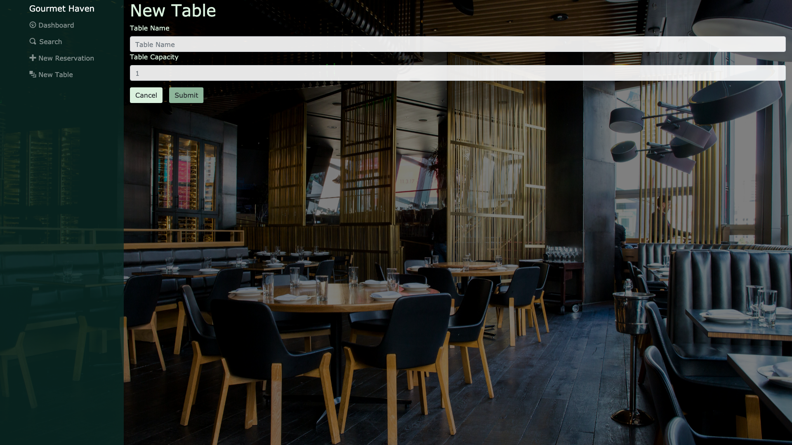
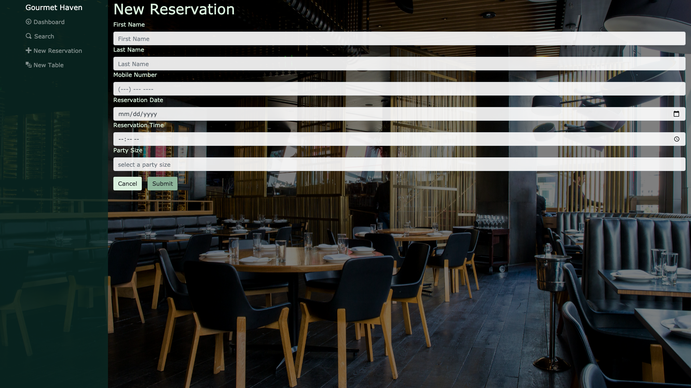
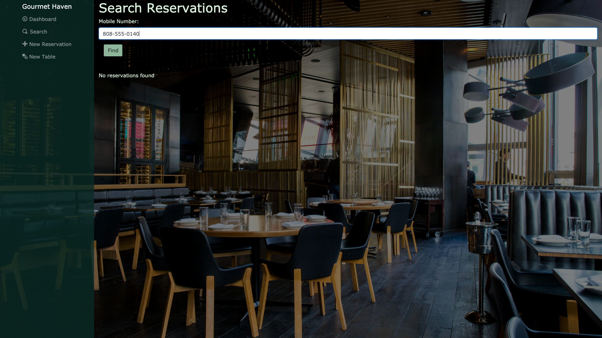
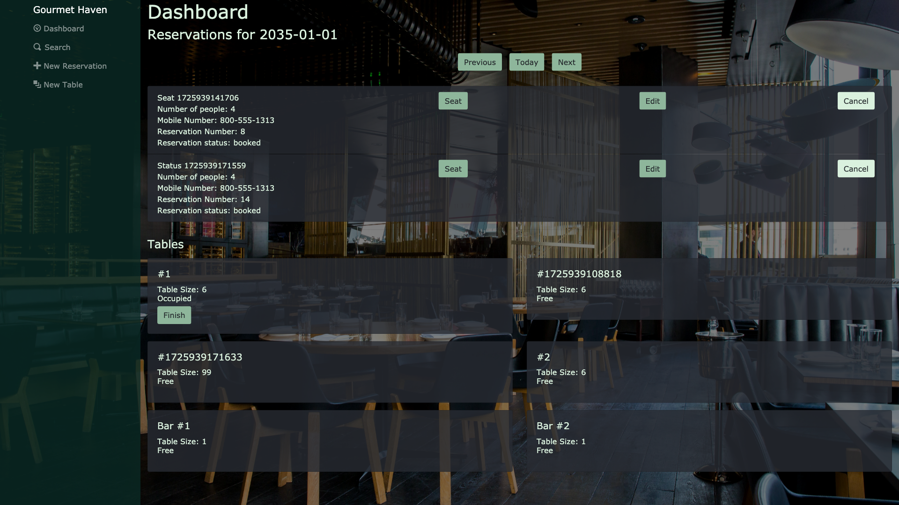

# Restaurant Reservation App

## Overview
The **Restaurant Reservation App** is a full-stack web application designed to simplify the reservation process for fine dining restaurants. It provides a user-friendly interface for customers to book tables and for restaurant staff to manage reservations efficiently.

### Dashboard


## New Table (Can be Deleted in Server)


## New Reservation (During business hours)


## Search Reservations


## Dashboard Display Status



## Features
- **User-Friendly Interface:** Elegant and intuitive UI with beautiful CSS styling for a seamless user experience.
- **Real-Time Reservation Management:** View available time slots and make reservations in real-time.
- **Admin Dashboard:** Restaurant staff can manage reservations, view customer details, and update availability.
- **Responsive Design:** Optimized for both desktop and mobile devices.

## Technologies Used
- **Frontend:**
  - HTML5, CSS3
  - JavaScript (React)
- **Backend:**
  - Node.js, Express.js
- **Database:**
  - PostgreSQL
- **Other Tools:**
  - pgAdmin for database management
  - Git for version control

## Installation

1. Clone the Repository
```bash
git clone https://github.com/mariluzc23/Restaurant-Reservation-App.git
```

2. Navigate into the Project Directory
```bash
cd Restaurant-Reservation-App
```

3. Install Dependencies
```bash
npm install
```

4. Start the Application
```bash
npm run start
```

To run Frontend only
```bash
npm run start:front-end
```
To run Backend only
```bash
npm run start:back-end
```


